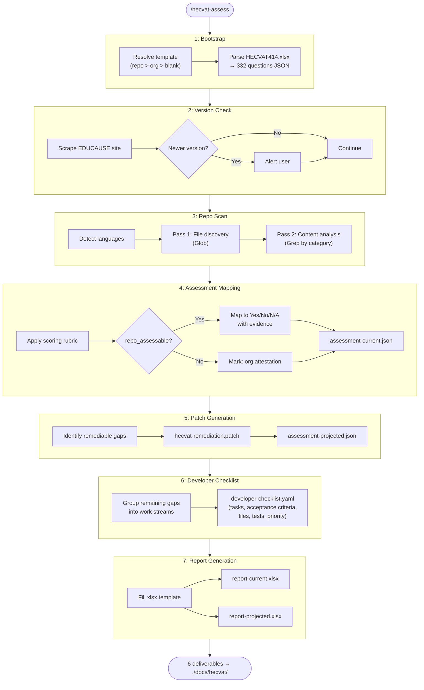

# hecvat-assess

A Claude Code skill that evaluates code repositories against the [EDUCAUSE HECVAT v4.1.4](https://www.educause.edu/higher-education-community-vendor-assessment-toolkit) (Higher Education Community Vendor Assessment Toolkit).

## What it does

Scans a repository's source code, configuration files, CI/CD pipelines, infrastructure-as-code, dependencies, and documentation to automatically assess ~48% of the 332 HECVAT questions. The remaining ~52% require organizational attestation (company info, legal agreements, staffing, certifications) that cannot be determined from code.

### Outputs

All deliverables are written to `./docs/hecvat/` in the assessed repository:

| File | Description |
|------|-------------|
| `hecvat-report-current.xlsx` | Filled HECVAT spreadsheet reflecting current compliance state |
| `hecvat-report-projected.xlsx` | Filled HECVAT spreadsheet projecting state after applying patches |
| `hecvat-remediation.patch` | Unified diff patch file for code/config fixes (`git apply` compatible) |
| `hecvat-improvement-developer-checklist.yaml` | Structured checklist for AI agents or developers to improve compliance |
| `assessment-current.json` | Machine-readable current assessment with evidence |
| `assessment-projected.json` | Machine-readable projected assessment (post-patch) |

## Installation

### From the marketplace (recommended)

Add the marketplace and install the plugin:

```
/plugin marketplace add sagearbor/hecvat-assess
/plugin install hecvat-assess@sagearbor-hecvat-assess
```

### Local testing

Clone the repo and load it directly:

```bash
git clone https://github.com/sagearbor/hecvat-assess.git
claude --plugin-dir ./hecvat-assess
```

### Dependencies

The report generation scripts require `openpyxl`:

```bash
pip install openpyxl
```

## Pre-filled organizational template

Most organizations will want to fill in their standard HECVAT answers once (company name, contacts, insurance, certifications, staffing, etc.) so those 174 organizational attestation questions aren't blank in every assessment.

### Setup

1. Copy the blank template to the org-wide config location:
   ```bash
   mkdir -p ~/.config/hecvat
   cp /path/to/hecvat-assess/HECVAT414.xlsx ~/.config/hecvat/hecvat-prefilled.xlsx
   ```
2. Open `~/.config/hecvat/hecvat-prefilled.xlsx` in Excel and fill in your organization's answers
3. Save. All future assessments will use this as the base template.

### Template priority

The skill checks for templates in this order (first match wins):

| Priority | Location | Use case |
|----------|----------|----------|
| 1 | `./docs/hecvat/hecvat-prefilled.xlsx` | Per-repo override (product-specific answers) |
| 2 | `~/.config/hecvat/hecvat-prefilled.xlsx` | Org-wide default (shared across all repos) |
| 3 | `SKILL_DIR/HECVAT414.xlsx` | Blank template (ships with skill) |

Neither override location is inside the skill directory, so your pre-filled templates are never overwritten when the skill is updated.

## Usage

Invoke within Claude Code on any repository:

```
/hecvat-assess
```

The skill also activates when you ask Claude to:
- "Evaluate this repo for HECVAT compliance"
- "Fill out a HECVAT for this project"
- "How ready is this repo for higher ed procurement?"

## How it works



> Interactive version: open [docs/workflow-diagram.html](docs/workflow-diagram.html) in any browser.

**Steps:**

1. **Bootstrap** -- Parses the HECVAT xlsx template into a JSON question cache (332 questions, 35 categories)
2. **Version check** -- Checks EDUCAUSE website for newer HECVAT versions
3. **Repo scan** -- Two-pass scan: file discovery (Glob) then content analysis (Grep) across all HECVAT categories
4. **Assessment mapping** -- Maps findings to Yes/No/N/A answers with confidence levels and evidence citations
5. **Patch generation** -- Generates unified diff patches for remediable compliance gaps
6. **Developer checklist** -- Builds a YAML checklist with parallel work streams, acceptance criteria, and test expectations
7. **Report generation** -- Fills the HECVAT xlsx template with assessment results (current + projected)

## Understanding the scores

### Why many questions are blank

174 of 332 questions (52%) are organizational attestation -- things like "do you have cyber insurance?", company addresses, staffing questions, legal agreements. No code scan can answer those. That's by design in the HECVAT; it's a vendor assessment questionnaire, not just a technical audit.

### Why some repos score low

If a repo genuinely has few security controls (no auth, no CI/CD, no security headers, no dependency scanning), the assessment will correctly reflect that. The tool isn't pessimistic -- some repos just have a large compliance gap. A mature production codebase with CI/CD, auth, and cloud infrastructure will score significantly better.

### Why the patch only fixes some questions

The remediation patch addresses things that can be fixed by adding files or configuration -- security headers middleware, GitHub Actions workflows, dependabot.yml, SECURITY.md. Remaining gaps require actual feature implementation (authentication systems, RBAC, encryption at rest, WAF, IDS, backup systems, accessibility overhauls) or organizational commitments that no patch file can provide. The developer checklist covers the broader set of improvements.

## Repo structure

```
hecvat-assess/
  .claude-plugin/
    plugin.json               -- Plugin manifest
    marketplace.json          -- Marketplace catalog for /plugin marketplace add
  skills/
    hecvat-assess/
      SKILL.md                -- Skill definition and 7-step workflow
      HECVAT414.xlsx          -- EDUCAUSE HECVAT v4.1.4 template (332 questions)
      hecvat-questions.json   -- Pre-parsed JSON cache of all questions
      scripts/
        parse_hecvat.py       -- XLSX to JSON parser
        generate_report.py    -- JSON assessment to filled XLSX report
        tests/                -- 43 tests for parse + report scripts
      references/
        scan-patterns.yaml    -- Structured Glob/Grep patterns by HECVAT category
        scoring-rubric.md     -- Scoring rules, confidence levels, evidence requirements
        scoring-weights.yaml  -- Category weights for weighted scoring
        language-patterns.yaml -- Language/framework detection patterns
        context-analysis.yaml -- Context-aware analysis rules
  README.md                   -- This file
  TESTING.md                  -- Test suite documentation
```

## HECVAT categories assessed

The skill covers 35 HECVAT categories across these domains:

- **Security**: Authentication (AAAI), Application Security (APPL), Data Security (DATA), Vulnerability Management (VULN)
- **Change Management**: CI/CD, testing, code review (CHNG)
- **Accessibility**: WCAG/ARIA compliance (ITAC)
- **AI Governance**: Model management, bias testing, LLM controls (AIML, AILM, AISC, AIGN, AIQU, DPAI)
- **Infrastructure**: Data center, operations (DCTR, OPEM)
- **Privacy/Compliance**: HIPAA, FERPA, PCI, GDPR (HIPA, FIDP, PCID, PDAT, PPPR)
- **Organizational** (attestation only): Company info, general, legal (GNRL, COMP, REQU, and others)

## License

This skill wraps the EDUCAUSE HECVAT, which is published by EDUCAUSE for use in higher education vendor assessments.
